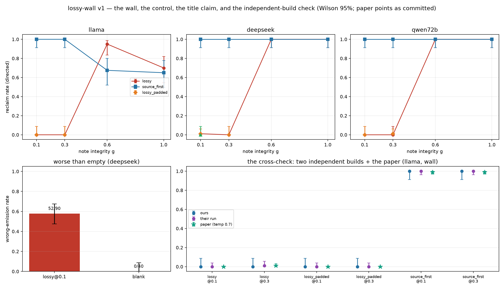

# lossy-wall

Reproduce and measure, at hobby scale, the **Brittle Memory** effect (arXiv
[2606.25449](https://arxiv.org/abs/2606.25449), *"Reclaim Evaluation: A Lossy Memory Is
Worse Than an Empty One"*): at a matched memory budget, a lossy note that keeps a wrong
conclusion but drops its recomputable source makes the error uncorrectable — the model
re-emits the stale value where an *empty* memory would abstain — while a source-first
note at the same budget stays fully correctable.

## Why

Compress-toward-the-conclusion is what shipped memory systems do today, and this paper
says that policy is *worse than remembering nothing* once the remembered conclusion is
wrong. The deltas are enormous (reclaim rate 0.00 vs 0.99–1.00 at the wall), scoring is
judge-free exact-match, the cure is training-free (a compression-policy choice), and the
paper's own primary model is a cheap 8B — hobby scale is the paper's *native* scale, not
a compromise. It is also a single-author, unreplicated paper: a careful independent
replication is genuinely useful, and **a null is pre-committed as a reportable verdict**.

Third rung of the reproduce-and-measure lineage:
[forge-gap](https://github.com/ksdisch/forge-gap) →
[decay-pin](https://github.com/ksdisch/decay-pin) → **lossy-wall**.

## What success looks like (v1)

All under pre-committed CI gates, on ≥2 of 3 models unless stated — the roster began
as the paper trio (llama-3.1-8b-instruct / deepseek-chat / qwen-2.5-7b, via
OpenRouter); qwen-2.5-7b fired its M0 drift-take trigger and v1 currently proceeds
two-model, with a qwen-2.5-72b re-attempt deferred to the M1 brief (D12):

1. **The wall** — at wall integrity (g ≤ 0.3), the lossy policy's reclaim rate has a
   Wilson CI consistent with ~0, *and* the Newcombe interval on (source_first − lossy)
   excludes zero.
2. **Content, not length** — at the wall, (lossy_padded − lossy) lands inside a
   pre-committed equivalence margin *and* (source_first − lossy_padded) excludes zero.
3. **Worse than empty** (the title claim) — on ≥1 disposed-to-answer model, the
   Newcombe interval on wrong-emission rate (lossy − blank) excludes zero.

Plus the g-sweep wall figure, a labeled comparison table against the paper's numbers,
and the **cross-check cell**: our independently built harness vs the author's released
[reclaim-eval](https://github.com/collapseindex/reclaim-eval) on one overlapping cell —
agreement or disagreement reported either way. Non-goals, always: direction + structure,
never point estimates; no LLM-judge grading, ever; zero frontier spend in v1.

## The verdict (v1 complete, 2026-07-08)

**All three pre-registered claims REPRODUCED at their pre-registered bars, and the
independent-build cross-check came back AGREE — the author's own harness, run
unmodified on the paper's own cell economy, lands within noise of our archived cells
on all six gated overlap cells.** Verdict words applied mechanically from the mapping
committed in `docs/M3-BRIEF.md` *before* the cross-check ran (D20):

| claim | verdict | the judged record |
|---|---|---|
| 1 — the wall | **REPRODUCED** (3/3 models; bar ≥2) | lossy reclaim ≤ 1/290 with every Wilson-95 ceiling under 0.10; source_first 240/240; every gap floor ≥ +87.6% |
| 2 — content, not length | **REPRODUCED** (3/3 models; bar ≥2) | every padded cell inside ±10% of plain lossy; sf − padded ≥ +87.6% everywhere |
| 3 — worse than empty (the title claim) | **REPRODUCED** (deepseek; bar ≥1 disposed model) | wrong-emission 52/90 lossy vs **0/40** blank, gap +58% [+44.2%, +67.5%]; the abstainers' predicted nulls reported plainly (llama +1/12, qwen72b 0/12) |
| cross-check (protocol fidelity) | **AGREE** (6/6 intervals contain zero) | their n=96 cells vs our archived cells: lossy 0/96 & 1/96 vs 0/40s; sf 96/96 vs 40/40s — two independent builds, one number apart across 576 gated trials |

The short-form comparison (full table with every label + footnote: `ROADMAP.md` M3):
at the wall, **paper-committed** (n=96, temp 0.7, bootstrap CI) · **their harness run
by us** (n=96, temp 0.0, Wilson + their boot_ci) · **ours** (n=40, temp 0.0, Wilson)
read lossy **0.00/0.01 · 0.00 · 0.00**, padded **0.00 · 0.00 · 0.00**, source_first
**0.99 · 1.00 · 1.00** — direction and structure identical in all three columns.
Protocol findings carried with the table: their `reproduce_tables.py` fails on its own
shipped artifact (empty `data/results/`); their parser mis-reads escaped
`ANSWER: \$…` commits as abstentions (proven mechanically: 0/8 archived deepseek
commits parsed; can only make their deepseek Δ+0.83 a floor); the paper v2 and their
README disagree in the last digit on three wall cells (both cited).

*Status: **M0 complete (2026-07-06)** — machinery green (anti-rig 3/3, 64 tests, $0
until gated), both riskiest assumptions answered YES for ≈ $0.17 total. Drift takes:
llama 14/20 (green) and deepseek **20/20** (green — first read 13/20 amber through a
parser blindspot on its LaTeX-escaped ANSWER lines, corrected during M1; see
ROADMAP's † note). The disposition probe reproduced the title claim's shape at full
strength on deepseek: lossy note at the wall → 11/12 confident wrong answers; blank
memory → 12/12 abstentions (Newcombe [+55%, +99%], corrected likewise). llama shows
the paper's predicted abstainer null (+1/12). Verdict
tables, cost ledger, and the qwen-slot story: `ROADMAP.md`.*

*Status: **M1 complete (2026-07-06)** — **claim 1 (the wall) CLEARED, 3 of 3 models.**
At matched character budget, directed corrections reclaim 1/290 lossy-note trials
(llama 0/80, deepseek 1/130 after its pre-committed escalation, qwen-2.5-72b 0/80)
vs **240/240** source-first trials; every lossy Wilson-95 upper bound sits under the
pre-committed 0.10 ceiling and every Newcombe gap floor is above +87%. The roster's
third slot resolved GREEN (D13: 72b took 18/20; labeled a same-family 10× substitute).
Mid-milestone, the mandatory checkpoint hand-read caught a live parser blindspot
(deepseek's LaTeX-escaped `ANSWER: \$…`), whose fix revised M0's deepseek take
verdict upward to 20/20 GREEN — details in ROADMAP's † note. The wall figure:
[`docs/figs/m1-wall.png`](docs/figs/m1-wall.png). M1 spend ≈ $0.45; project ≈ $0.62.*

*Status: **M2 complete (2026-07-07)** — **claim 2 (content, not length) CLEARED,
3 of 3 models; claim 3 (worse than empty — the title claim) CLEARED on deepseek.**
The budget-match control: padding the lossy note to the source-first note's length
rescued nothing (2/350 padded reclaims, both hand-read lucky guesses; every padded
cell contained inside the pre-committed ±10% of plain lossy, both escalations
resolving at 1/90) while source_first beats the padded note by ≥ +87.6% everywhere.
The emission gap, counted blind against M1's archived rows only after the blank arm
reached its final N: lossy 52/90 confident wrong answers vs blank **0/40** (40/40
explicit declines) — gap +58%, Newcombe [+44.2%, +67.5%]. The knob fills complete
the committed figure ([`docs/figs/m2-knob.png`](docs/figs/m2-knob.png),
[`docs/figs/m2-emission.png`](docs/figs/m2-emission.png)); llama's high-g dip is
real model behaviour, documented in the checkpoint record. M2 spend $0.29 measured;
project ≈ $0.91.*

*Status: **M3 complete (2026-07-08) — v1 done.** The one paid item was the **oracle
run**: the author's `run_pilot.py`, unmodified, from its own clone and venv, on the
paper's economy (32 problems × 3 seeds = n=96/cell, llama, 4,896 calls, **$0.055
measured**, ~7.6h serial background). Its seed-1 checkpoint held (our recount matched
their console cell-for-cell; 9/9 spot-checked rows internally consistent), and the
pre-committed agreement criterion returned **AGREE on all six gated cells** — the
verdict table above. The bootstrap appendix (their `boot_ci` re-typed, B=5,000, seed
0) covers all 39 gated numbers with **zero method disagreements**, the 0/n degeneracy
displayed as the taught reason Wilson decides (D4). Capstone:
[`docs/figs/capstone.png`](docs/figs/capstone.png). Project total ≈ **$0.97** of
KICKOFF's "likely under $10." The post-v1 fork (gated M4 logic family / M5 boundary
arm vs close-and-`/seed-hunt`) is presented as a decision brief in `ROADMAP.md` M3 —
Kyle's call, deliberately not made here.*

*Status: **M4 complete (2026-07-08) — the logic family, PARTIAL** (first post-v1 extension).
Tested whether the effect survives a change of task (arithmetic → constraint-deduction puzzles).
**The fix generalizes decisively on deepseek** — source_first reclaims 60/60 at both wall g while
the lossy floor collapses and a note that keeps the *corrupted premise* drives inheritance to
45–70% (worse-than-empty, on logic). **qwen did not clear**, for a real (non-bug) reason the
mandatory checkpoint hand-read diagnosed: on ordering puzzles the directed correction acts as a
*flip* instruction, which qwen obeys (inflating lossy, breaking source_first) and deepseek resists.
With llama sat out (its D24 drift-take pilot fired a real trigger, 9/20 — surfaced only after a
take-probe format bug was caught and fixed, PR #28), that is one clean model of the two the
≥2-model bar needs → **PARTIAL on both claims**. Two first-class findings ride along: deepseek's
worse-than-empty, and the directed-correction × ordering-logic interaction. Figure:
[`docs/figs/m4-logic-wall.png`](docs/figs/m4-logic-wall.png). M4 spend $0.433 measured; project
≈ $1.40.*

*Status: **M5 complete (2026-07-09) — the source-size boundary arm, REPRODUCED** (second post-v1
extension; the falsification stage). Tested where the source_first *fix* fails: hold the note's
character budget fixed and grow the receipt, and past the point where the note can't keep every
line item, `source_first` **cliffs** to 0 — and the cliff **tracks the budget, not problem size**
(crossover N=4 at budget 300, N=12 at 600, bracketing the paper's own N≈5 / N≈14). The mechanism is
exact — full source reclaims 139/140, partial source 0/108 ("an exact sum needs every item"). Past
the cliff the fix does not abstain; it **silently mis-sums the partial source** to a confident wrong
total (worse-than-empty), confirmed on real deepseek at the mandatory hand-read. A boundary-of-the-
boundary rode along: drift-take collapses at 24 items (deepseek re-derives rather than accept the
plant), so that size drops out. This was the milestone whose signed design got **reversed before any
spend** — the paper-boundary extraction (a free pre-commit) found the author's released bench uses
grow-N-at-two-budgets, not the fixed-N sweep the brief proposed, so D28 was reopened A→B to
reproduce the paper's actual result. Judged at N=20 (the 0/1 effect resolved decisively; the signed
N=40 would have been low-value spend). Figure: [`docs/figs/m5-boundary.png`](docs/figs/m5-boundary.png).
M5 spend $0.726 measured; project ≈ $2.13, far inside KICKOFF's "under $10."*

The docs spine: [`docs/KICKOFF.md`](docs/KICKOFF.md) (approved scope, phased plan, gate
record — the source of truth) · [`DECISIONS.md`](DECISIONS.md) (running ledger, D1–D30)
· [`ROADMAP.md`](ROADMAP.md) (milestone status + verdict tables and cost ledgers) ·
[`LEARNING.md`](LEARNING.md) (teaching notes + vocabulary) ·
[`docs/M0-BRIEF.md`](docs/M0-BRIEF.md) (the M0 start-of-stage brief) ·
[`docs/M1-BRIEF.md`](docs/M1-BRIEF.md) (the M1 start-of-stage brief, signed) ·
[`docs/M2-BRIEF.md`](docs/M2-BRIEF.md) (the M2 start-of-stage brief, signed) ·
[`docs/M3-BRIEF.md`](docs/M3-BRIEF.md) (the M3 start-of-stage brief, signed) ·
[`docs/M4-BRIEF.md`](docs/M4-BRIEF.md) (the M4 start-of-stage brief, signed & closed — PARTIAL) ·
[`docs/M5-BRIEF.md`](docs/M5-BRIEF.md) (the M5 start-of-stage brief, signed & closed — REPRODUCED;
D28 reopened A→B on the paper extraction).
