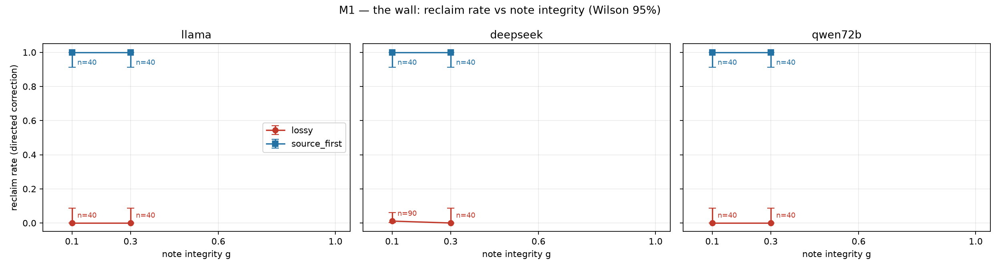
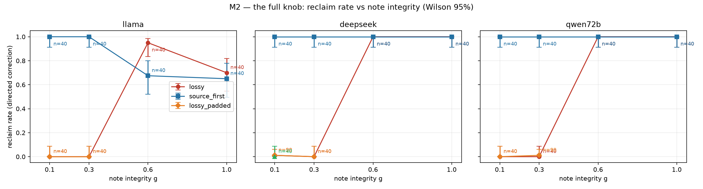
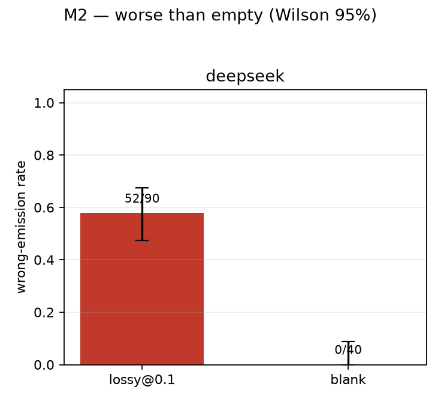
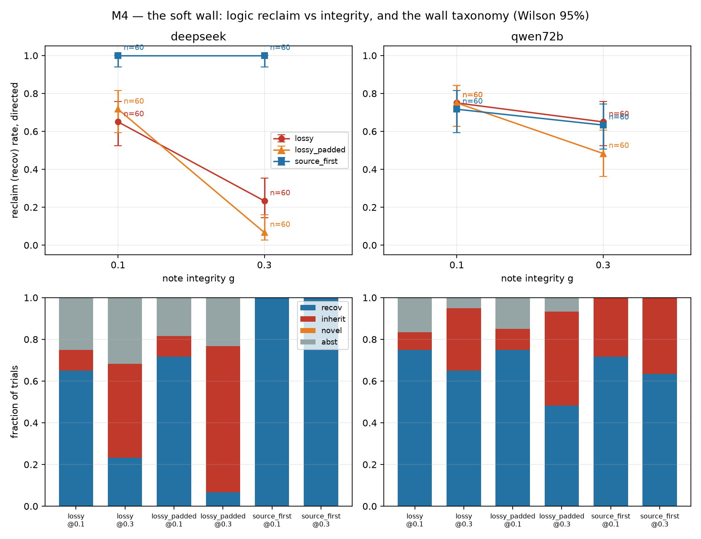
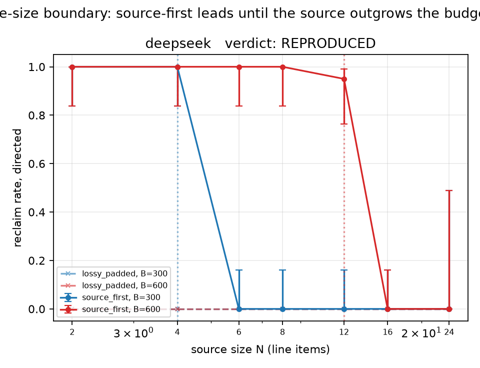

# A Lossy Memory Is Worse Than an Empty One: An Independent, Hobby-Scale Replication of the Brittle Memory Effect

*Kyle Disch · the lossy-wall project ([ksdisch/lossy-wall](https://github.com/ksdisch/lossy-wall)) · 2026-07-09*

*Replication target: arXiv [2606.25449](https://arxiv.org/abs/2606.25449) v2, "Reclaim Evaluation: A Lossy Memory Is Worse Than an Empty One," and its released harness, [reclaim-eval](https://github.com/collapseindex/reclaim-eval) (Apache-2.0). All effects reported here were first published there; this project's contribution is an independent rebuild, a pre-registered measurement, and a cross-check — not a new discovery.*

---

## Abstract

When an LLM memory system compresses a conversation into a note, it must choose what survives. The Brittle Memory paper (arXiv 2606.25449) reports that a **lossy** note — one that keeps a conclusion but drops the recomputable source behind it — makes a remembered *error* uncorrectable: told exactly where the error is, the model re-emits the stale wrong value, where an *empty* memory would abstain. A **source-first** note at the same character budget stays fully correctable. We rebuilt the paper's protocol independently from its description, pre-registered every gate before spending, and measured the effect on three small models via OpenRouter for ≈$2.13 total. All three pre-registered v1 claims **REPRODUCED** at their pre-committed bars: (1) *the wall* — directed corrections reclaimed 1 of 290 lossy-note trials vs 240 of 240 source-first trials, every between-arm gap floor ≥ +87.6% (3/3 models); (2) *content, not length* — padding the lossy note to source-first's exact length rescued nothing (2/350 reclaims; every padded cell within a pre-committed ±10% of plain lossy) (3/3 models); (3) *worse than empty* — with a lossy note deepseek-chat emitted a confident wrong answer in 52/90 trials vs **0/40** with a blank note (gap +58%, 95% CI [+44.2%, +67.5%]), while the two abstainer-disposed models showed the paper's predicted null. A cross-check running the author's own unmodified harness on the paper's cell economy came back **AGREE** on all six gated overlap cells. Two gated extensions: the logic-family arm came back **PARTIAL** (decisive on one model; the second confounded by a directed-correction × ordering-puzzle interaction we report as a finding), and the source-size boundary arm **REPRODUCED** the paper's falsification result — the source-first fix cliffs to zero once the source outgrows the note budget, and the cliff tracks the budget (crossover at 4 items under a 300-character budget vs 12 items under 600), failing by *silent mis-sum* rather than abstention.

---

## 1. Introduction

Shipped LLM memory systems compress toward conclusions: they summarize what was decided and drop the working that produced it. That is a sensible-sounding economy with a failure mode this paper's title states exactly — once the remembered conclusion is *wrong*, a note that kept the conclusion and dropped its source is worse than remembering nothing, because the source is the only thing a later correction can recompute from.

This document reports an independent replication of that effect at hobby scale. The framing is deliberate and load-bearing: **we reproduced and measured a published finding — this is the narrow, measured slice, not an invention.** The paper is single-author and (at replication time) unreplicated; its own primary model is an 8-billion-parameter open model, so hobby scale is the paper's native scale rather than a compromise. A null result was pre-committed as a reportable verdict before any measurement ran.

The contribution of this replication, concretely:

- An **independent rebuild** of the protocol from the paper's description (templates re-typed verbatim with attribution; the author's package never imported), which tests whether the paper's words are sufficient instructions — something re-running the author's code cannot test.
- **Pre-registered gates** for every claim — the statistical criterion, sample-size schedule, and verdict vocabulary (REPRODUCED / PARTIAL / NULL / DISCREPANT) fixed in writing before the data existed.
- A **cross-check**: one pre-committed overlap region run through the author's own released harness, unmodified, with agreement or disagreement reportable either way.
- Two gated extensions reproducing the paper's task-generality arm (logic) and its falsification arm (where the fix itself fails) — including one honest PARTIAL.

Everything below is measured; every number traces to a committed file in the repository (Section 8).

## 2. Background: the published effect being reproduced

The Brittle Memory setup uses two sessions. **Session 1** induces an error: the model works an arithmetic ledger problem, a wrong intermediate value is planted ("a note says the pens come to $27"), and the model commits to the resulting wrong total across eight follow-up turns (*drift*, in the paper's vocabulary; a trial where the model commits is a *take*). **Session 2** is a fresh conversation whose only inheritance is a memory note, followed by a *directed correction* — the model is told exactly which component was wrong (without being given the right value) and asked to recompute.

What the note keeps is governed by two knobs, both the paper's:

- **Integrity g** — what fraction of the memory survives compression, implemented as a threshold mapping: at g ≥ 0.5 every policy keeps the source line items; below 0.5 ("the wall") the policies diverge.
- **Policy** — *lossy* keeps the (wrong) conclusion and drops the source; *source_first* keeps the source (prices and quantities) and drops the conclusion; *lossy_padded* is the lossy note padded with content-free filler to at least source_first's character length (the budget-match control); *blank* carries neither.

The paper's headline numbers on its primary model (llama-3.1-8b-instruct, arithmetic, directed corrections, its Table 5): reclaim rate at wall integrity is 0.00–0.01 for lossy and lossy_padded vs 0.99 for source_first. Its title claim is the disposition result: an answering-disposed model with a lossy note *emits* wrong values where a blank memory abstains (the paper's corrected disposition deltas: deepseek-chat +0.83, qwen-2.5-7b +0.39, llama +0.17). Its boundary section shows the fix is not unconditional: grow the source past the note budget and source-first reclaim "cliffs to 0.00 the instant one item is dropped," with the crossover tracking the budget (N≈5 at a 300-character budget, N≈14 at 600).

The guardrail primitives this project used to measure all of that — exact-match answer-line grading, per-trial mechanical verification, proportion confidence intervals, pre-registration — are established practice, reproduced here, not originated here.

## 3. Methods

**Judge-free scoring, never an LLM judge.** Grading reads the committed value after the last `ANSWER:` marker on the model's reply, strictly — no adjacent number means no numeric commit. A wrong reply classifies as an *abstention* if no value parses or a hedge phrase (the author's list, verbatim) appears; otherwise it is an *emission* (of the planted stale value — the *attractor* — or another wrong value). Parsing is where silent scoring corruption lives — the paper's own v2 fixed a parser bug — so the parser carries unit tests plus an **anti-rig validator suite**: a deterministic fake model that reclaims *only* when the source's line-item tokens are present in its context, so a passing validation cannot be produced by a model that pattern-matches its way to the answer. The author's harness passes the equivalent three checks; ours had to pass 3/3 before the project's first paid call.

**Per-trial source-absence verification.** A note only counts as lossy if the recomputable source is demonstrably absent — a mechanical token test on the note string, run before every session-2 call. Notes are pure functions of (problem, g, policy), re-typed verbatim from the paper's App. A and the author's `experiment.py` (read as protocol reference under decision D1; never imported, never a dependency).

**Statistics.** A reclaim rate is a proportion, so cells carry **Wilson score intervals** and between-arm differences carry **Newcombe intervals**; these decide every gate (decision D4). A 0/40 cell is reported as "Wilson 95% [0%, 8.8%] — consistent with ~0," never "proved 0." Equivalence (claim 2) uses containment: the interval on (padded − lossy) must sit entirely inside a margin **δ = ±0.10 pre-committed before the project's first paid API call** (D7). A bootstrap appendix re-typing the author's own interval method (percentile, B=5,000, seed 0) covers all 39 gate-driving numbers: **zero Wilson-vs-bootstrap gate disagreements**, and the appendix displays *why* Wilson decides — every all-zero cell's bootstrap collapses to a degenerate [0.000, 0.000] beside Wilson's honest [0%, 8.8%].

**Pre-commitment discipline.** Every claim's gate, N-schedule, escalation rule, and verdict mapping was signed in a start-of-stage brief before its data existed. Sample sizes followed pre-committed ladders (checkpoint at N=20 with a mandatory human hand-read of raw replies; judge at N=40; at most one escalation to N≈90 on a stray). Cells are **judged once** — never re-run after a verdict. Claim 3's counting rule was committed while its archived comparator's abstain-vs-emit split was still untallied, and the judge *refuses in code* to count before the blank arm's final N. All run evidence is committed to the repository per milestone (`evidence/`), which is what later made a conservative re-score of archived M0 data possible when a parser blindspot was found.

**The hand-read rule earned its keep three times.** Deterministic fakes validate mechanics, not real-model behavior: the mandatory checkpoint hand-reads caught (1) deepseek LaTeX-escaping its answer lines (`ANSWER: \$197`), which the author-verbatim parser read as abstention — every affected error ran conservative, and re-scoring archived data revised one M0 verdict *upward* (deepseek drift-take 13/20 → 20/20); (2) a logic take-probe that wasn't format-explicit, producing a false 0/20 on llama (truly 9/20); and (3) M4's ordering confound (Section 5.5) before the full grid spend. These are reported as part of the record, not smoothed away.

**Sampling.** Temperature 0.0 / max_tokens 600, matching the author's released tool defaults (D10) — with the observed caveat that temperature 0 is not determinism (provider-side serving variation was seen run-to-run), so N carries the statistics; temperature is recorded on every logged row. One divergence from the paper's trial economy, chosen deliberately: a **fresh generated problem per trial** (D5) rather than the paper's 32-problems × 3-seeds reuse, because Wilson intervals assume independent trials. The author's problems are themselves machine-generated from the same grammar, making fresh generation protocol-consistent; paper-faithful bookkeeping lives in the cross-check (Section 5.4).

## 4. Experimental setup

**Models (via OpenRouter).** The paper trio was the pre-registered roster: llama-3.1-8b-instruct (the paper's primary model, anchoring the cross-check), deepseek-chat (the paper's strongest answering disposition, carrying claim 3), qwen-2.5-7b-instruct. qwen-2.5-7b fired its pre-committed drift-take trigger in the fit-pilot (5/20 takes — it re-derives the correct total rather than trusting the plant); the pre-written fired path ran (fidelity audit, then a same-family swap), landing on **qwen-2.5-72b-instruct — labeled in every table as a same-family, 10×-size substitution, never as the paper's model.** Drift-take rates at N=20 (a measurement the paper does not report): llama 14/20, deepseek 20/20 (after the parser correction), qwen72b 18/20.

**Arms and budget.** v1 measured one task family (arithmetic ledgers), g ∈ {1.0, 0.6, 0.3, 0.1} with the wall cells (g ≤ 0.3) gated and the rest descriptive, the three policies at matched character budget plus blank at the wall, directed corrections only. N ≥ 20 per cell scaling to 40–90 under the ladders. Total measured cost, all six milestones: **≈ $2.13** (v1 alone ≈ $0.97), against a planning envelope of "likely under $10." The binding constraint throughout was the statistics — the width of proportion intervals at hobby N — not the code or the cost.

## 5. Results

### 5.1 Claim 1 — the wall (REPRODUCED, 3/3 models; bar was ≥2)

Gate (D14, pre-committed): every lossy wall cell's Wilson-95 *upper bound* ≤ 0.10, and the Newcombe interval on (source_first − lossy) excludes zero, at both g ∈ {0.1, 0.3}.

| model | lossy@0.1 | lossy@0.3 | source_first@0.1 | source_first@0.3 | gap@0.1 (Newcombe 95%) | gap@0.3 | verdict |
|---|---|---|---|---|---|---|---|
| llama-3.1-8b | 0/40 [0%, 8.8%] | 0/40 [0%, 8.8%] | 40/40 [91%, 100%] | 40/40 [91%, 100%] | +100% [+87.6%, +100%] | +100% [+87.6%, +100%] | **CLEARED** |
| deepseek-chat | 1/90 [0.2%, 6.0%] (escalated) | 0/40 [0%, 8.8%] | 40/40 [91%, 100%] | 40/40 [91%, 100%] | +99% [+88.8%, +99.8%] | +100% [+87.6%, +100%] | **CLEARED** |
| qwen-2.5-72b (substitute) | 0/40 [0%, 8.8%] | 0/40 [0%, 8.8%] | 40/40 [91%, 100%] | 40/40 [91%, 100%] | +100% [+87.6%, +100%] | +100% [+87.6%, +100%] | **CLEARED** |

Aggregate: **1 reclaim in 290 lossy trials vs 240/240 source-first trials.** The one lossy "reclaim" was hand-read: a lucky round-number confabulation with no source in context — the paper's own "lucky recovery" case — kept as a reclaim under strict scoring; its cell escalated per the pre-committed ladder to N=90, gained zero further reclaims, and cleared. This is the paper's 0.00-vs-0.99 wall, reproduced.

*Figure 1 — reclaim rate vs memory integrity g, per model. At wall integrity the lossy policy sits at ~0 and source_first at ~1; above the source threshold (g ≥ 0.5) the policies converge, as the protocol predicts.*

### 5.2 Claim 2 — content, not length (REPRODUCED, 3/3 models; bar was ≥2)

Gate (D16): Newcombe on (lossy_padded − lossy) contained entirely inside the pre-committed ±0.10, **and** (source_first − lossy_padded) excludes zero, at both wall g.

| model | padded@0.1 | padded@0.3 | equivalence @0.1 | equivalence @0.3 | separation @0.1 | separation @0.3 | verdict |
|---|---|---|---|---|---|---|---|
| llama | 0/40 | 0/40 | +0% [−8.8%, +8.8%] | +0% [−8.8%, +8.8%] | +100% [+87.6%, +100%] | +100% [+87.6%, +100%] | **CLEARED** |
| deepseek | 1/90 (escalated) | 0/40 | +0% [−5.0%, +5.0%] | +0% [−8.8%, +8.8%] | +99% [+88.8%, +99.8%] | +100% [+87.6%, +100%] | **CLEARED** |
| qwen72b | 0/40 | 1/90 (escalated) | +0% [−8.8%, +8.8%] | +1% [−7.7%, +6.0%] | +100% [+87.6%, +100%] | +99% [+88.8%, +99.8%] | **CLEARED** |

Same character budget, same lossy content plus content-free filler: padding rescued nothing (2 reclaims in 350 padded trials, both hand-read lucky recoveries kept under strict scoring), while source_first beat the padded note by at least +87.6% everywhere. The correction runs on what the characters *say*, not how many there are.

*Figure 2 — full g-sweep per model with padded points at the wall and deepseek's blank point. llama's dip at high g is real model behavior (token-cap abstains plus genuine attractor re-emissions with the source in hand), documented at the checkpoint hand-read, not smoothed away.*

### 5.3 Claim 3 — worse than empty, the title claim (REPRODUCED on deepseek; bar was ≥1 answering-disposed model)

Gate (D17): Newcombe on the wrong-emission gap (lossy − blank) excludes zero. The counting rule was committed blind (the archived comparator's split untallied until judge time, enforced in code).

| arm | wrong emissions | attractor | other-wrong | abstain | reclaimed |
|---|---|---|---|---|---|
| lossy@0.1 (archived, n=90) | **52/90 (58%)** | 33 | 19 | 37 | 1 |
| blank (n=40) | **0/40 (0%)** | 0 | 0 | 40 | 0 |

Gap **+58%, Newcombe 95% [+44.2%, +67.5%] — CLEARED.** Over identical session-1 trajectories, deepseek holding a blank note declined 40/40 times; holding the lossy note it confidently emitted a wrong figure 58% of the time — 33 of the 52 being the exact stale value it had committed in session 1. The lossy note is not degraded memory; it is an error generator a blank memory does not have.

The two abstainer-disposed models showed the paper's *predicted* null, reported plainly: llama probe +1/12 vs 0/12 (Newcombe [−17%, +35%] — an interval that already contains the paper's llama delta of +0.17), qwen72b 0/12 vs 0/12. Pre-registered caveat: the two deepseek arms were sampled on different dates (same pinned model, route, temperature, and bank trajectories).

*Figure 3 — wrong-emission counts, lossy (52/90) vs blank (0/40), deepseek.*

### 5.4 The cross-check — two independent builds of one protocol (AGREE, 6/6 cells)

The author's released harness was run **unmodified, from its own clone and virtual environment, at its own tool defaults, on the paper's own cell economy** (32 problems × 3 seeds = n=96 per cell, llama, 4,896 calls, $0.055 measured). Pre-committed criterion (D20): AGREE iff the Newcombe 95% interval on (their rate − ours) contains zero on all six wall-region overlap cells.

| cell | theirs (n=96) | ours (archived) | difference [95% CI] |
|---|---|---|---|
| lossy@0.1 | 0/96 | 0/40 | +0.000 [−0.088, +0.038] |
| lossy@0.3 | 1/96 | 0/40 | +0.010 [−0.078, +0.057] |
| lossy_padded@0.1 | 0/96 | 0/40 | +0.000 [−0.088, +0.038] |
| lossy_padded@0.3 | 0/96 | 0/40 | +0.000 [−0.088, +0.038] |
| source_first@0.1 | 96/96 | 40/40 | +0.000 [−0.038, +0.088] |
| source_first@0.3 | 96/96 | 40/40 | +0.000 [−0.038, +0.088] |

**Verdict: AGREE — all six intervals contain zero.** Two codebases, written by different people from the same paper, one number apart across the 576 gated trials of the oracle run. This retires the project's fourth riskiest assumption: the paper's protocol description is complete enough to reproduce from.

Beside the agreement, three **protocol findings** about the author's artifact, reported in both directions of the trust relationship: (1) their `reproduce_tables.py` exits nonzero on the public repository as shipped (it ships an empty `data/results/`); (2) their answer parser has no backslash escape, so `ANSWER: \$197` reads as an abstention — proven mechanically against our archived replies (their parser read 0/8 escaped deepseek commits; ours 8/8; plain controls agree 4/4). Directionally this can only *shrink* a lossy−blank emission gap, so their published deepseek delta of +0.83 would be a floor, not an artifact, if the bug bit at all — whether it moved their published numbers is unknowable from their committed artifacts (no raw replies); (3) the paper v2 and their repository README disagree in the last digit on three arithmetic wall cells; both are the author's numbers, and the comparison carries the paper's.

*Figure 4 — the capstone: knob curves per model, the claim-3 emission bars, and the cross-check panel with ours / their-harness-run / paper-committed visibly coincident on the six wall cells. Column labels matter: the paper column is temperature 0.7 with bootstrap intervals; the two measured columns are temperature 0.0 with Wilson intervals.*

### 5.5 Gated extension 1 — the logic family (PARTIAL, honestly)

M4 asked whether the effect survives a task change: arithmetic ledgers → constraint-deduction puzzles, where the paper itself shows a **soft wall** (its llama logic floor does not collapse to 0). Gates were re-derived for the soft regime and pre-committed (D25): claim 1 gates on the gap (source_first − lossy) excluding zero at both wall g; claim 2 on separation (source_first − padded); the ±0.10 equivalence containment was pre-registered as *unpowerable* at hobby N on mid-range rates and reported descriptively. N=60 per cell, judged once.

Results (reclaim rate, N=60, directed): **deepseek cleared both claims decisively** — source_first 60/60 at both wall g; gaps +35% [+22.6%, +47.6%] at g=0.1 and +77% [+63.2%, +85.6%] at g=0.3; separations +28% and +93%. And the thesis reappeared in a sharper form: the g=0.3 lossy note (which keeps the *corrupted premise*) drove the model to inherit the planted error in 27/60 trials, and padding that note to source length made it *stickier* — 42/60 (70%) inheritance. **qwen72b did not clear** — gaps −3% [−18.8%, +12.4%] and −2% [−18.3%, +15.1%], straddling zero.

The checkpoint hand-read traced qwen's null to a real interaction, not a bug: on *ordering* puzzles the directed correction ("the X-vs-Y order was wrong") reads as a **flip instruction**. qwen obeys it — flipping the bare drift conclusion to correct under lossy (inflating that cell) and flipping the *true* fact to the drift under source_first (deflating it; every one of its source_first errors was the planted drift, zero novel errors — the diagnostic tell). deepseek re-derives and resists. On *assignment* puzzles both models show the effect cleanly (gaps +0.67 deepseek, +0.83 qwen), but the take-biased bank is ordering-heavy, so the stratified two-model test is underpowered and reported descriptively.

With llama sitting out (its logic drift-take pilot fired a genuine trigger at 9/20 — after a take-probe format bug producing a false 0/20 was caught by hand-read and fixed), one clean model of the two the pre-committed ≥2-model bar requires gives **PARTIAL on both claims**. This was the most falsification-shaped milestone in the project — the kickoff had flagged logic as the one place a partial or null was plausible — and the confound is reported as a first-class finding. Reference anchors, both the author's, with a documented variance: the paper v2 prints the llama logic wall cells as lossy 0.05/0.16, source_first 0.79/0.76 (g=0.1/0.3), while the author's repository README prints lossy 0.12/0.25, source_first 0.67/0.67; the extraction record carries both, and no gate consumes either (direction and structure only).

*Figure 5 — the soft wall on logic: deepseek shows the gap decisively; qwen's cells are confounded by the correction-as-flip interaction on ordering puzzles.*

### 5.6 Gated extension 2 — the source-size boundary arm (REPRODUCED)

M5 is the falsification stage: *where does the fix fail?* Following the paper's released design (fix the note's character budget B, grow the source size N in line items, at two budgets), on deepseek, arithmetic, N=20 per cell, judged under a pre-committed gate (D29: ceiling intact at smallest N, drop excludes zero, monotone, crossover tracks the budget, mechanism split excludes zero):

| source size N (items) | 2 | 4 | 6 | 8 | 12 | 16 | crossover |
|---|---|---|---|---|---|---|---|
| **B=300** — source_first reclaim | 20/20 | 20/20 | **0/20** | 0/20 | 0/20 | 0/20 | **N=4** (paper ≈5) |
| **B=600** — source_first reclaim | 20/20 | 20/20 | 20/20 | 20/20 | 19/20 | **0/20** | **N=12** (paper ≈14) |

Every gate cleared: per-budget drop **+100% [+48.4%, +100%]**; the crossover moves with the budget (4 < 12), landing beside the paper's own anchors (N≈5, N≈14) — if the cliff were problem difficulty, it would sit at the same N regardless of budget. The mechanism is exact: with the **full** source in the note, 139/140 reclaims; with a **partial** source, 0/108 (Δ+99% [+94.6%, +99.9%]) — an exact sum needs every item.

Three reported findings ride along. First, the **silent mis-sum**: past the cliff, source_first does not abstain — it confidently sums the *partial* source to a wrong total (classified `emit_other_wrong`: neither the truth nor the planted value, but the sum of the items that survived), confirmed genuine at the mandatory hand-read. Worse than an empty memory, which at least declines. Second, **lossy_padded (budget-matched) sits at 0/20 everywhere** — the cliff is source *content*, not note length. Third, a boundary of the boundary: at N=24 items the *drift-take precondition itself* collapses (4/48 takes — deepseek re-derives the correct total rather than accept a planted error on a 24-item receipt), so that size is unmeasurable and is reported as such. Two process facts of record: the signed sweep design was **reversed before any spend** (D28-A → D28-B) when the pre-committed extraction found the author's released bench uses grow-N-at-two-budgets — the project reproduced the *published* design, not its own guess; and the signed N=40 was amended to judge at N=20 at the checkpoint, because the 0/1-rate effect had already resolved every gate with margin — recorded honestly as an amendment.

*Figure 6 — the boundary: source_first reclaim vs source size N at budgets 300 and 600. The cliff moves with the budget; the lossy_padded floor sits at 0 throughout.*

## 6. Discussion

**What was reproduced.** The paper's central mechanism survived an independent rebuild at every point we measured it: the wall (claim 1), the budget-match control that pins it on content (claim 2), the title claim's disposition split (claim 3, on the one answering-disposed model in the roster, exactly as the paper predicts), the two-build agreement (cross-check), the generalization with its soft-wall caveat (M4, PARTIAL), and the fix's own failure boundary (M5). Direction and structure, never point estimates — that non-goal was set at kickoff and held.

**The unifying reading.** Across arithmetic, logic, and the size sweep, the same variable does the work: *whether the recomputable source survives into the carried note*. Where it survives, directed corrections work almost perfectly; where it doesn't, they fail almost completely — and the failure mode is not ignorance but confident error (re-emitting the attractor; inheriting a corrupted premise; silently mis-summing a partial source). "Worse than an empty memory" is the accurate summary: in every family, the model holding the bad note *emitted* where the model holding nothing *abstained*.

**What the PARTIAL means.** M4's verdict is not a hedge; it is the pre-committed vocabulary doing its job. The fix generalized decisively on one model and the second model's cells are confounded by a genuine protocol interaction (a directed correction that names an ordering error functions as a flip instruction on ordering puzzles). A replication that can only output "reproduced" isn't a measurement.

**Limitations.** (1) Hobby N: cell sizes of 20–90 give wide intervals away from the extremes; every claim's gate was chosen to be decidable at these N, and cells that couldn't be powered (M4's mid-range equivalence) were pre-registered as descriptive rather than gated. (2) The qwen slot ran a same-family 10×-size substitute, so the paper's qwen-2.5-7b disposition delta (+0.39) has no comparable cell here. (3) Claim 3's two arms were sampled on different dates (pre-registered). (4) The paper-committed column is temperature 0.7 while both measured columns are 0.0 (the released tool's default); the comparison is labeled, never point-matched. (5) M5's crossover locations are grid-resolution-limited (N=5 was not sampled; the crossover is "the largest sampled N still reclaiming above 0.5"). (6) One task ecology: generated ledger and puzzle problems with a planted error and a directed correction — nothing here speaks to deployed memory systems, undirected corrections, or frontier models, all explicitly out of scope at kickoff.

## 7. Provenance

Every number above traces to a committed repository file. The evidence directories hold the per-trial JSONL records the summaries were computed from.

| claim / number | value | source of record |
|---|---|---|
| Claim 1 verdict table (per-model cells, gaps) | 1/290 vs 240/240; gaps ≥ +87.6% | `ROADMAP.md` §M1 (D14 table); `evidence/m1/` |
| Deepseek escalation (1/90, hand-read) | [0.2%, 6.0%] | `ROADMAP.md` §M1; `evidence/m1/m1-checkpoint/RECORD.md` |
| Claim 2 verdict table (containment, separation) | 2/350; all inside ±0.10; ≥ +87.6% | `ROADMAP.md` §M2 (D16 table); `evidence/m2/` |
| Claim 3 splits and gap | 52/90 vs 0/40; +58% [+44.2%, +67.5%] | `ROADMAP.md` §M2 (D17 table); `DECISIONS.md` D17 |
| Abstainer nulls | llama 1/12 vs 0/12; qwen72b 0/12 vs 0/12 | `ROADMAP.md` §M0 (D9), §M2 |
| Cross-check table, 6 cells, AGREE | all intervals contain zero | `ROADMAP.md` §M3; `evidence/m3/m3-agreement-judge.txt` |
| Oracle-run economy and cost | 4,896 calls, n=96/cell, $0.055 | `ROADMAP.md` §M3 (D19 outcome) |
| Comparison table vs paper Table 5 | see §5.4 / capstone | `evidence/m3/m3-comparison-table.md`; `evidence/m3/paper-extraction.md` |
| Parser-blindspot proof | 0/8 theirs vs 8/8 ours; controls 4/4 | `ROADMAP.md` §M3 footnotes; `evidence/m3/` fixture |
| Bootstrap appendix | 39 rows, zero disagreements | `evidence/m3/bootstrap-appendix.txt`; `DECISIONS.md` D21 |
| M0 drift-take and disposition verdicts (incl. † correction) | llama 14/20; deepseek 20/20; qwen-7b 5/20; 11/12 vs 0/12 | `ROADMAP.md` §M0 + † note |
| M4 grid, gaps, confound, PARTIAL | +35%/+77% vs −3%/−2%; inherit 27/60, 42/60 | `ROADMAP.md` §M4; `DECISIONS.md` D25; `evidence/m4/judge.txt` |
| Paper/README logic anchors (variance documented) | 0.05/0.16 vs 0.12/0.25 etc. | `evidence/m4/paper-extraction-logic.md` |
| M5 grid, crossovers, mechanism, REPRODUCED | N=4/12; 139/140 vs 0/108 | `ROADMAP.md` §M5; `DECISIONS.md` D29–D30; `evidence/m5/judge.txt` |
| M5 paper anchors (N≈5, N≈14; silent mis-sum) | README Size bullet | `evidence/m5/paper-extraction-boundary.md` |
| Costs (per milestone and ≈$2.13 total) | see §4 | `ROADMAP.md` cost ledgers, §M0–M5 |
| Pre-registration record (all gates, δ, ladders, mappings) | D1–D30 | `DECISIONS.md`; `docs/M0–M5-BRIEF.md` |

One documented source discrepancy, resolved toward the record nearest the raw fetch: `ROADMAP.md`'s M4 table labels its reference column "paper (llama, ref)" but carries the values the author's repository README prints (lossy 0.12/0.25, source_first 0.67/0.67); the extraction record (`evidence/m4/paper-extraction-logic.md`) shows the paper v2 prints 0.05/0.16 and 0.79/0.76. Both sets are the author's numbers; Section 5.5 carries both with labels, and no verdict consumed either.

## 8. Anticipated questions

**The errors are planted. Isn't this a manufactured problem?** Yes, deliberately — and it is measured as such. Drift induction is the paper's protocol: the wrong premise is injected so that the error's provenance and ground truth are exactly known, which is what makes judge-free exact-match scoring possible. Every reclaim measurement explicitly *conditions on* the model committing to the planted value first (the take), and take rates are reported per model. What the planting buys is a clean measurement of the correction mechanics; what it costs is ecological generality, which is listed as a limitation, not hidden.

**Why Wilson/Newcombe intervals rather than the paper's bootstrap?** Because the wall cells live at 0% and 100%, exactly where the percentile bootstrap degenerates — every resample of 0/40 is 0/40, so its interval collapses to [0.000, 0.000], maximal confidence where evidence is thinnest. Wilson reports the honest [0%, 8.8%]. The choice was pre-committed (D4), and the bootstrap appendix shows it never drove a verdict: 39 rows, zero disagreements on any gate.

**What is the un-validatable residual?** Whether the *author's published numbers* were themselves affected by their parser's escaped-dollar blindspot is unknowable from their committed artifacts (their result rows carry no raw replies). We bounded the direction — on the lossy arm an under-read can only shrink the lossy−blank gap, so their +0.83 is a floor if the bug bit at all — and we verified our own build against theirs live at the cross-check.

**Why these models?** They are the paper's own roster (D3): its primary model for comparability, its strongest answering disposition to carry the title claim, and a second family. When qwen-2.5-7b failed the drift-take precondition, the pre-written trigger path ran and the substitution is labeled everywhere.

**One model carried claim 3. Is that enough?** It is the pre-registered bar (≥1 answering-disposed model), and it is what the paper itself predicts: abstainer-disposed models *should* show no gap, and ours did not — those nulls are reported as confirmations of the predicted shape, not buried.

**Why was M5 judged at N=20 when N=40 was signed?** The pre-committed checkpoint found every gate already cleared with tight intervals on 0/20-vs-20/20 cells; extending would have roughly doubled the milestone's spend to change no verdict. The amendment was made at the checkpoint, by the project owner, and is recorded as an amendment — the contrast case is M4, where a genuinely mid-range floor bought its full N=60.

**Roads not taken?** Deployed memory systems (LangChain/mem0/vector stores), MultiWOZ, the cascade and adversarial batteries, the eight-model disposition sweep, frontier-model replay, undirected corrections, and any LLM-judge grading — all explicitly on the kickoff's never-list. The two extensions that were taken (logic, boundary) were gated on the v1 effect showing, and it did.

## References

- arXiv 2606.25449 (v2), *Reclaim Evaluation: A Lossy Memory Is Worse Than an Empty One* — the replication target; all effect definitions, templates, and anchor numbers. (HTML: arxiv.org/html/2606.25449v2)
- `reclaim-eval` — the author's released harness (github.com/collapseindex/reclaim-eval, Apache-2.0), used as protocol reference and cross-check oracle only; never imported.
- Lineage repositories: [forge-gap](https://github.com/ksdisch/forge-gap) → [decay-pin](https://github.com/ksdisch/decay-pin) → lossy-wall (harness shape and statistics ported from decay-pin).
