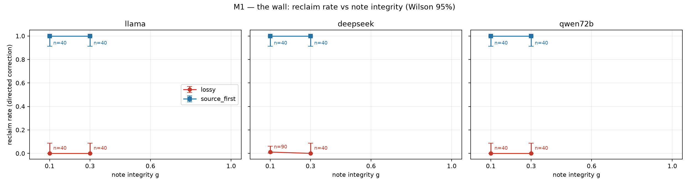
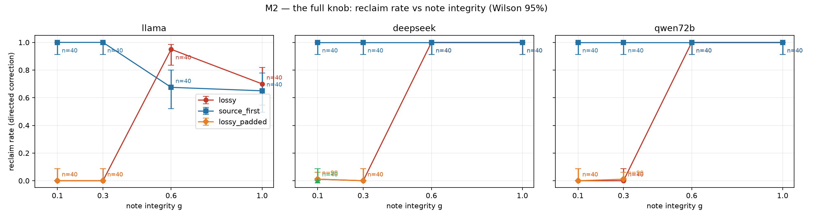
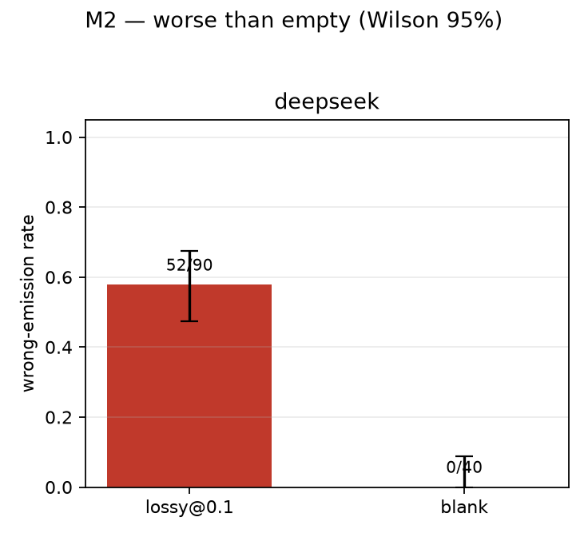
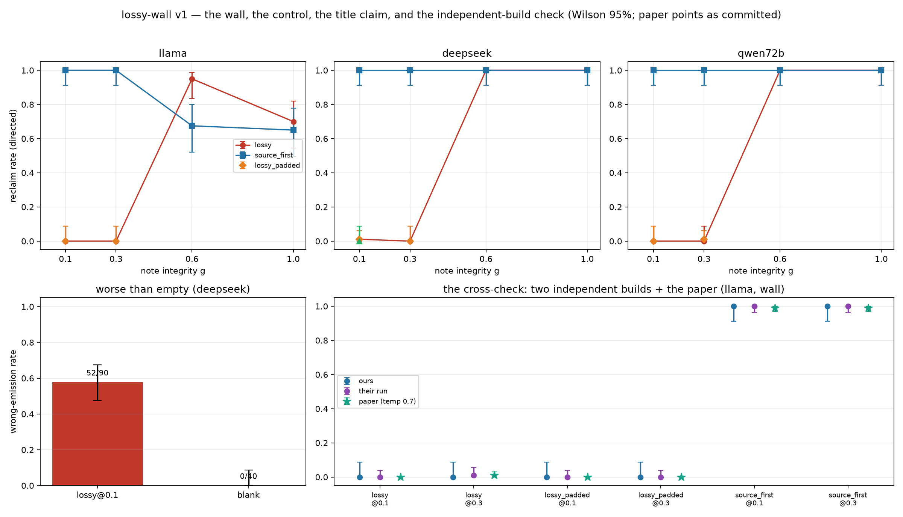
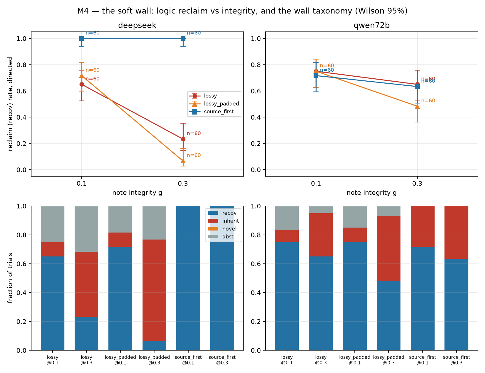
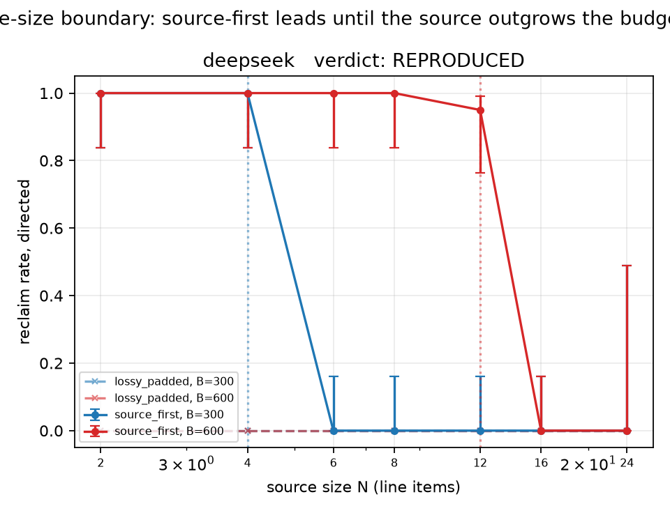

# A Lossy Memory Is Worse Than an Empty One: An Independent, Hobby-Scale Replication of the Brittle Memory Effect

> **This is a plain-English rewrite.** It mirrors the original paper 1:1 — same headings,
> same paragraphs, same order. Nothing is summarized, merged, dropped, or reordered; only
> the language changes. Tables are reproduced exactly as they appear in the original, each
> followed by an italic *"In plain words"* line; figures keep their original images with
> rewritten captions. The references section is carried through untouched.
>
> **Original paper:** *A Lossy Memory Is Worse Than an Empty One: An Independent, Hobby-Scale Replication of the Brittle Memory Effect*
> **Author:** Kyle Disch
> **Source:** `docs/paper/lossy-wall-paper.md` (branch `docs/paper-presenter-brief`, open PR [#34](https://github.com/ksdisch/lossy-wall/pull/34))
> **Rewrite generated:** 2026-07-27

---

*Kyle Disch · the lossy-wall project ([ksdisch/lossy-wall](https://github.com/ksdisch/lossy-wall)) · 2026-07-09*

*The paper being replicated: arXiv [2606.25449](https://arxiv.org/abs/2606.25449) version 2, "Reclaim Evaluation: A Lossy Memory Is Worse Than an Empty One," together with the test harness its author released, [reclaim-eval](https://github.com/collapseindex/reclaim-eval) (Apache-2.0 licence). Every effect reported here was first published there; what this project adds is an independent rebuild, a measurement whose rules were fixed in advance, and a cross-check — not a new discovery.*

---

## Abstract

When a large language model's memory system squeezes a conversation down into a note, it has to decide what to keep. The Brittle Memory paper (arXiv 2606.25449) reports that a **lossy** note — one that keeps a conclusion but throws away the underlying facts you could have recalculated it from — makes a remembered *mistake* impossible to fix: told exactly where the mistake is, the model repeats the stale wrong number, whereas a model with an *empty* memory would simply decline to answer. A **source-first** note, squeezed into the same number of characters, stays completely fixable. We rebuilt the paper's procedure from scratch using only its written description, fixed every pass/fail rule in writing before spending any money, and measured the effect on three small models through OpenRouter for about $2.13 in total. All three of the pre-registered first-round claims **REPRODUCED** at the bars we had committed to: (1) *the wall* — pointed corrections rescued 1 out of 290 lossy-note trials versus 240 out of 240 source-first trials, with every gap between conditions having a lower bound of at least +87.6% (on all 3 models); (2) *it's the content, not the length* — padding the lossy note out to exactly the source-first note's length rescued nothing (2 rescues in 350 trials; every padded condition landed within a pre-committed ±10% of the plain lossy one) (on all 3 models); (3) *worse than empty* — given a lossy note, deepseek-chat produced a confidently wrong answer in 52 of 90 trials versus **0 of 40** with a blank note (a gap of +58%, with a plausible range of [+44.2%, +67.5%]), while the two models that tend to decline rather than answer showed exactly the no-effect result the paper predicts. A cross-check that ran the original author's own unmodified harness on the paper's own trial budget came back **AGREE** on all six overlapping test conditions. Two further extensions, each gated on the earlier results: the logic-puzzle version came back **PARTIAL** (decisive on one model, with the second model confounded by an interaction between pointed corrections and ordering puzzles that we report as a finding in its own right), and the source-size boundary version **REPRODUCED** the paper's own falsification result — the source-first fix falls off a cliff to zero once the source grows bigger than the note's character budget, and where that cliff sits tracks the budget (it appears at 4 items under a 300-character budget versus 12 items under 600), failing by *silently adding up the wrong numbers* rather than by declining to answer.

---

## 1. Introduction

Real-world memory systems for language models compress toward conclusions: they record what was decided and drop the working that led there. That sounds like a sensible economy, and it has a failure mode this paper's title names exactly — once the remembered conclusion is *wrong*, a note that kept the conclusion and dropped its source is worse than remembering nothing at all, because the source is the only thing a later correction has to recalculate from.

This document reports an independent replication of that effect on a hobby budget. The framing is deliberate and it carries weight: **we reproduced and measured a published finding — this is the narrow, measured slice of it, not an invention.** The paper has a single author and, at the time we replicated it, nobody had checked it; its own main test subject is an open model with 8 billion parameters, so hobby scale is the paper's native scale rather than a compromise we had to make. Before any measurement ran, we committed in writing that a no-effect result would count as a reportable outcome.

Concretely, this replication contributes:

- An **independent rebuild** of the procedure from the paper's written description (with the prompt templates re-typed word for word and attributed; the author's own package was never imported), which tests whether the paper's words are sufficient as instructions — something you cannot test by re-running the author's code.
- **Pass/fail rules fixed in advance** for every claim — the statistical criterion, the schedule for how many trials to run, and the vocabulary of verdicts (REPRODUCED / PARTIAL / NULL / DISCREPANT) all written down before the data existed.
- A **cross-check**: one pre-committed region of overlap run through the author's own released harness, unmodified, with the result reportable whether it agreed or disagreed.
- Two gated extensions reproducing the paper's does-it-generalize arm (logic puzzles) and its where-does-it-break arm — including one honest PARTIAL.

Everything below is measured; every number traces back to a file committed to the repository (Section 8).

## 2. Background: the published effect being reproduced

The Brittle Memory setup uses two sessions. **Session 1** induces a mistake: the model works through an arithmetic ledger problem, a wrong intermediate value is planted in front of it ("a note says the pens come to $27"), and the model sticks with the resulting wrong total across eight follow-up turns (the paper calls this *drift*; a trial where the model swallows the plant is a *take*). **Session 2** is a fresh conversation whose only inheritance is a memory note, followed by a *pointed correction* — the model is told exactly which component was wrong, without being told the right value, and is asked to work it out again.

What the note keeps is set by two dials, both of them the paper's:

- **Integrity g** — the fraction of the memory that survives compression, implemented as a cut-off: at g of 0.5 or above, every policy keeps the itemized source lines; below 0.5 ("the wall") the policies part ways.
- **Policy** — *lossy* keeps the (wrong) conclusion and drops the source; *source_first* keeps the source (the prices and quantities) and drops the conclusion; *lossy_padded* is the lossy note stuffed with meaningless filler until it is at least as long as the source-first note (the length-matched control); *blank* carries neither.

The paper's headline numbers on its main model (llama-3.1-8b-instruct, arithmetic, pointed corrections, its Table 5): at wall-level integrity the rescue rate is 0.00–0.01 for the lossy and padded-lossy notes versus 0.99 for source-first. Its title claim is the disposition result: a model inclined to answer will, holding a lossy note, *produce* wrong values in situations where a blank memory makes it decline (the paper's corrected disposition gaps: deepseek-chat +0.83, qwen-2.5-7b +0.39, llama +0.17). Its boundary section shows the fix has conditions: grow the source past the note's budget and source-first rescue "cliffs to 0.00 the instant one item is dropped," with the position of that cliff tracking the budget (roughly 5 items at a 300-character budget, roughly 14 at 600).

The basic measurement tools this project used to capture all of that — grading by exact match on the answer line, mechanical checking of every trial, confidence intervals for percentages, committing to rules in advance — are established practice, reproduced here rather than invented here.

## 3. Methods

**Scoring never involves another model as judge.** Grading reads the value committed after the final `ANSWER:` marker in the model's reply, strictly — if there is no number next to it, nothing was committed. A wrong reply counts as *declining* if no value can be read out or if a hedging phrase appears (using the author's list, word for word); otherwise it counts as *emitting* something — either the planted stale value (which the paper calls the *attractor*) or some other wrong value. Parsing is exactly where scoring quietly goes wrong — the paper's own version 2 fixed a parser bug — so our parser carries unit tests plus an **anti-rigging validation suite**: a fake, fully predictable model that only ever rescues when the source's line-item words are actually present in its context, so a passing validation cannot be faked by a model that pattern-matches its way to the answer. The author's harness passes the equivalent three checks; ours had to pass all three before the project made its first paid call.

**Checking on every trial that the source really is absent.** A note only counts as lossy if the recalculable source is demonstrably not there — a mechanical word-search over the note text, run before every session-2 call. Notes are produced purely from the combination of problem, integrity level, and policy, re-typed word for word from the paper's Appendix A and the author's `experiment.py` (which was read as a reference for the procedure under decision D1; never imported, never a dependency).

**Statistics.** A rescue rate is a percentage, so every cell carries a **Wilson score interval** — a standard way of putting a plausible range around a percentage — and comparisons between conditions carry **Newcombe intervals**, the equivalent for the gap between two percentages; these decide every pass/fail rule (decision D4). A cell reading 0 out of 40 is reported as "Wilson 95% [0%, 8.8%] — consistent with about zero," never as "proved to be zero." Claim 2's equivalence test works by containment: the interval on (padded minus lossy) has to sit entirely inside a margin of **±0.10, committed before the project's first paid API call** (D7). A separate appendix re-typing the author's own interval method (the percentile bootstrap, 5,000 resamples, seed 0) covers all 39 numbers that drive a verdict: **not one disagreement between the two methods on any pass/fail decision**, and the appendix shows *why* we let Wilson decide — every all-zero cell's bootstrap collapses to a meaningless [0.000, 0.000] next to Wilson's honest [0%, 8.8%].

**Committing in advance.** Every claim's pass/fail rule, trial-count schedule, escalation rule, and verdict mapping was signed off in a start-of-stage brief before its data existed. Sample sizes followed pre-committed ladders (a checkpoint at 20 trials with a compulsory human read-through of the raw replies; judgement at 40; at most one escalation to about 90 if something odd turned up). Cells are **judged exactly once** — never re-run after a verdict. Claim 3's counting rule was committed while the archived comparison arm's decline-versus-answer split was still uncounted, and the judging script *refuses in code* to count anything before the blank arm reaches its final trial count. All the evidence from every run is committed to the repository milestone by milestone (`evidence/`), which is what later made it possible to conservatively re-score archived early data when a parser blind spot turned up.

**The read-it-yourself rule paid for itself three times over.** Predictable fake models validate the machinery, not how real models behave: the compulsory checkpoint read-throughs caught (1) deepseek escaping its answer lines in mathematical-typesetting style (`ANSWER: \$197`), which the author-verbatim parser read as declining to answer — every affected case ran in the conservative direction, and re-scoring the archived data revised one early verdict *upward* (deepseek's drift-take rate went from 13/20 to 20/20); (2) a logic-puzzle take-check that wasn't explicit about the required format, producing a false 0-out-of-20 on llama when the true figure was 9 out of 20; and (3) the ordering confound described in Section 5.5, caught before the full grid was paid for. These are reported as part of the record rather than quietly smoothed over.

**Sampling settings.** Temperature 0.0 and a 600-token reply cap, matching the defaults of the author's released tool (D10) — with the observed caveat that temperature 0 does not actually mean identical outputs (we saw the provider's serving vary from run to run), so the sample size is what carries the statistics; the temperature is recorded on every logged row. We diverged from the paper's trial economy in one deliberate way: **a freshly generated problem for every trial** (D5) rather than the paper's approach of reusing 32 problems across 3 random seeds, because Wilson intervals assume the trials are independent of one another. The author's problems are themselves machine-generated from the same grammar, which makes fresh generation consistent with the procedure; the paper's own bookkeeping is honoured in the cross-check instead (Section 5.4).

## 4. Experimental setup

**Models (through OpenRouter).** The paper's trio was the roster we registered in advance: llama-3.1-8b-instruct (the paper's main model, anchoring the cross-check), deepseek-chat (the model most inclined to answer, which carries claim 3), and qwen-2.5-7b-instruct. qwen-2.5-7b tripped its pre-committed drift-take rule during the fit pilot (only 5 takes out of 20 — it works out the correct total for itself instead of trusting the plant); the pre-written response path ran (a fidelity audit, then a swap within the same model family), landing on **qwen-2.5-72b-instruct — labelled in every table as a same-family substitute that is 10 times the size, never as the paper's model.** Drift-take rates at 20 trials, a measurement the paper does not report: llama 14 of 20, deepseek 20 of 20 (after the parser correction), qwen72b 18 of 20.

**Conditions and budget.** The first round measured one task family (arithmetic ledgers), integrity levels of 1.0, 0.6, 0.3 and 0.1 — with the wall-level cells (0.3 and below) gated and the rest reported descriptively — the three note policies at matched character budget, plus the blank note at the wall, using pointed corrections only. Each cell ran at least 20 trials, scaling to between 40 and 90 under the ladders. Total measured cost across all six milestones: **about $2.13** (the first round alone about $0.97), against a planning envelope of "probably under $10." The binding constraint throughout was the statistics — how wide a percentage's interval is at hobby-scale trial counts — not the code and not the money.

## 5. Results

### 5.1 Claim 1 — the wall (REPRODUCED, 3/3 models; bar was ≥2)

The pass/fail rule, committed in advance as D14: every lossy wall cell's Wilson *upper* bound must be 0.10 or lower, and the Newcombe interval on (source-first minus lossy) must exclude zero, at both integrity levels 0.1 and 0.3.

| model | lossy@0.1 | lossy@0.3 | source_first@0.1 | source_first@0.3 | gap@0.1 (Newcombe 95%) | gap@0.3 | verdict |
|---|---|---|---|---|---|---|---|
| llama-3.1-8b | 0/40 [0%, 8.8%] | 0/40 [0%, 8.8%] | 40/40 [91%, 100%] | 40/40 [91%, 100%] | +100% [+87.6%, +100%] | +100% [+87.6%, +100%] | **CLEARED** |
| deepseek-chat | 1/90 [0.2%, 6.0%] (escalated) | 0/40 [0%, 8.8%] | 40/40 [91%, 100%] | 40/40 [91%, 100%] | +99% [+88.8%, +99.8%] | +100% [+87.6%, +100%] | **CLEARED** |
| qwen-2.5-72b (substitute) | 0/40 [0%, 8.8%] | 0/40 [0%, 8.8%] | 40/40 [91%, 100%] | 40/40 [91%, 100%] | +100% [+87.6%, +100%] | +100% [+87.6%, +100%] | **CLEARED** |

*In plain words: one row per model. The first four number columns show how many trials were rescued out of how many, with the plausible range in brackets, for the lossy note and the source-first note at each of the two wall-level integrity settings. The lossy columns sit at essentially zero and the source-first columns at essentially perfect. The two gap columns give the difference between them, and because every one of those ranges stays far above zero, all three models cleared the bar.*

Adding it all up: **1 rescue across 290 lossy trials, versus 240 out of 240 source-first trials.** The single lossy "rescue" was read by hand: a lucky round-number guess with no source anywhere in its context — the same "lucky recovery" case the paper itself describes — and we kept it as a rescue under strict scoring; its cell was escalated along the pre-committed ladder to 90 trials, gained no further rescues, and cleared. This is the paper's 0.00-versus-0.99 wall, reproduced.

*Figure 1 — how often the correction succeeds, plotted against how much of the memory survived compression, for each model. At wall-level integrity the lossy policy sits at roughly zero and source-first at roughly one; above the threshold where the source survives (0.5 and up) the two policies come together, exactly as the procedure predicts.*

### 5.2 Claim 2 — content, not length (REPRODUCED, 3/3 models; bar was ≥2)

The rule (D16): the Newcombe interval on (padded lossy minus plain lossy) must sit entirely inside the pre-committed ±0.10, **and** (source-first minus padded lossy) must exclude zero, at both wall-level integrity settings.

| model | padded@0.1 | padded@0.3 | equivalence @0.1 | equivalence @0.3 | separation @0.1 | separation @0.3 | verdict |
|---|---|---|---|---|---|---|---|
| llama | 0/40 | 0/40 | +0% [−8.8%, +8.8%] | +0% [−8.8%, +8.8%] | +100% [+87.6%, +100%] | +100% [+87.6%, +100%] | **CLEARED** |
| deepseek | 1/90 (escalated) | 0/40 | +0% [−5.0%, +5.0%] | +0% [−8.8%, +8.8%] | +99% [+88.8%, +99.8%] | +100% [+87.6%, +100%] | **CLEARED** |
| qwen72b | 0/40 | 1/90 (escalated) | +0% [−8.8%, +8.8%] | +1% [−7.7%, +6.0%] | +100% [+87.6%, +100%] | +99% [+88.8%, +99.8%] | **CLEARED** |

*In plain words: the "equivalence" columns ask whether padding the lossy note out to full length changed anything — every range sits inside the ±10% margin, meaning it did not. The "separation" columns ask whether the source-first note still beat the padded one — every range sits far above zero, meaning it did, overwhelmingly. So length is not what matters.*

Same character budget, same lossy content plus meaningless filler: the padding rescued nothing (2 rescues across 350 padded trials, both read by hand as lucky recoveries and kept under strict scoring), while the source-first note beat the padded note by at least +87.6% everywhere. The correction runs on what the characters *say*, not on how many of them there are.

*Figure 2 — the full sweep across integrity levels for each model, with the padded-note points marked at the wall and deepseek's blank-note point included. llama's dip at high integrity is genuine model behaviour (a mixture of declining because it hit the token cap and genuinely re-emitting the planted value even with the source in front of it), documented at the checkpoint read-through rather than smoothed away.*

### 5.3 Claim 3 — worse than empty, the title claim (REPRODUCED on deepseek; bar was ≥1 answering-disposed model)

The rule (D17): the Newcombe interval on the wrong-answer gap (lossy minus blank) must exclude zero. The counting rule was committed blind — the archived comparison arm's split was left uncounted until judging time, and this was enforced in code.

| arm | wrong emissions | attractor | other-wrong | abstain | reclaimed |
|---|---|---|---|---|---|
| lossy@0.1 (archived, n=90) | **52/90 (58%)** | 33 | 19 | 37 | 1 |
| blank (n=40) | **0/40 (0%)** | 0 | 0 | 40 | 0 |

*In plain words: two rows, one for each kind of note. "Wrong emissions" counts the times the model confidently stated a wrong figure; "attractor" is the subset where that figure was the exact stale value planted earlier, and "other-wrong" is some different wrong number. "Abstain" counts the times it declined to answer. With a lossy note the model answered wrongly 52 times out of 90; with a blank note it declined all 40 times and never once answered wrongly.*

The gap is **+58%, Newcombe 95% [+44.2%, +67.5%] — CLEARED.** Over identical session-1 histories, deepseek holding a blank note declined all 40 times; holding the lossy note it confidently produced a wrong figure 58% of the time — and 33 of those 52 were the exact stale value it had committed to in session 1. The lossy note is not degraded memory; it is an error generator that a blank memory does not have.

The two models inclined to decline rather than answer showed the paper's *predicted* no-effect result, reported plainly: llama 1 out of 12 versus 0 out of 12 (Newcombe range [−17%, +35%] — a range that already contains the paper's own llama gap of +0.17), and qwen72b 0 out of 12 versus 0 out of 12. One caveat registered in advance: deepseek's two conditions were sampled on different dates (using the same pinned model, the same route, the same temperature and the same bank of session histories).

*Figure 3 — counts of confidently wrong answers, lossy note (52 of 90) against blank note (0 of 40), for deepseek.*

### 5.4 The cross-check — two independent builds of one protocol (AGREE, 6/6 cells)

The author's released harness was run **unmodified, from its own fresh copy and its own isolated environment, at its own default settings, on the paper's own trial economy** (32 problems × 3 seeds = 96 trials per cell, on llama, for 4,896 calls costing a measured $0.055). The criterion committed in advance (D20): we would call it AGREE only if the Newcombe 95% interval on (their rate minus our rate) contained zero in all six overlapping wall-region cells.

| cell | theirs (n=96) | ours (archived) | difference [95% CI] |
|---|---|---|---|
| lossy@0.1 | 0/96 | 0/40 | +0.000 [−0.088, +0.038] |
| lossy@0.3 | 1/96 | 0/40 | +0.010 [−0.078, +0.057] |
| lossy_padded@0.1 | 0/96 | 0/40 | +0.000 [−0.088, +0.038] |
| lossy_padded@0.3 | 0/96 | 0/40 | +0.000 [−0.088, +0.038] |
| source_first@0.1 | 96/96 | 40/40 | +0.000 [−0.038, +0.088] |
| source_first@0.3 | 96/96 | 40/40 | +0.000 [−0.038, +0.088] |

*In plain words: each row compares one test condition as measured by the author's code against the same condition as measured by ours. The final column is the difference between the two, with its plausible range. Every range contains zero, meaning the two independently written codebases produced results that cannot be told apart — and in raw counts they differed by exactly one trial in total.*

**Verdict: AGREE — all six intervals contain zero.** Two codebases, written by different people from the same paper, ended up one number apart across the 576 judged trials of the reference run. This retires the fourth-riskiest assumption in the project: that the paper's written description of its procedure is complete enough to rebuild from.

Alongside the agreement, three **findings about the author's artifact**, reported in both directions of the trust relationship: (1) their `reproduce_tables.py` fails when run against the public repository as shipped, because it ships an empty `data/results/` directory; (2) their answer parser does not handle backslash escapes, so `ANSWER: \$197` reads as declining to answer — we proved this mechanically against our own archived replies (their parser read 0 of 8 escaped deepseek commitments; ours read 8 of 8; on plain unescaped controls the two agree 4 out of 4). Directionally this can only ever *shrink* a lossy-versus-blank gap, so their published deepseek figure of +0.83 would be a floor rather than an artifact if the bug bit at all — whether it actually moved their published numbers cannot be determined from what they committed, since their result rows carry no raw replies; and (3) version 2 of the paper and their repository's README disagree in the last digit on three arithmetic wall cells; both sets are the author's own numbers, and our comparison uses the paper's.

*Figure 4 — the summary figure: the integrity-sweep curves for each model, the claim-3 answer bars, and the cross-check panel showing our results, the author's-harness run, and the paper's published values sitting visibly on top of one another across the six wall cells. The column labels matter: the paper's column was run at temperature 0.7 with bootstrap intervals, while both measured columns are at temperature 0.0 with Wilson intervals.*

### 5.5 Gated extension 1 — the logic family (PARTIAL, honestly)

The fourth milestone asked whether the effect survives a change of task: from arithmetic ledgers to constraint-deduction puzzles, where the paper itself finds a **soft wall** — its llama logic floor does not fall all the way to zero. The pass/fail rules were re-derived for that softer regime and committed in advance (D25): claim 1 is judged on the gap (source-first minus lossy) excluding zero at both wall-level integrity settings; claim 2 on the separation (source-first minus padded); and the ±0.10 equivalence containment was registered in advance as *impossible to power* at hobby-scale trial counts on mid-range rates, so it is reported descriptively. 60 trials per cell, judged once.

The results (rescue rate, 60 trials, pointed corrections): **deepseek cleared both claims decisively** — source-first scored 60 out of 60 at both wall settings; the gaps were +35% [+22.6%, +47.6%] at integrity 0.1 and +77% [+63.2%, +85.6%] at 0.3; the separations were +28% and +93%. And the underlying thesis reappeared in a sharper form: the integrity-0.3 lossy note (which keeps the *corrupted premise*) led the model to inherit the planted mistake in 27 of 60 trials, and padding that note out to source length made the mistake *stickier* still — 42 out of 60, or 70%, inherited it. **qwen72b did not clear** — its gaps were −3% [−18.8%, +12.4%] and −2% [−18.3%, +15.1%], both straddling zero.

The checkpoint read-through traced qwen's null result to a genuine interaction rather than a bug: on *ordering* puzzles, the pointed correction ("the X-versus-Y order was wrong") reads as an instruction to **flip**. qwen obeys it — flipping the bare drifted conclusion into the correct one under the lossy note, which inflates that cell, and flipping the *true* fact into the drifted one under source-first, which deflates it. The diagnostic giveaway: every single one of its source-first errors was the planted drift value, with zero novel errors. deepseek works the answer out from scratch and resists. On *assignment* puzzles both models show the effect cleanly (gaps of +0.67 for deepseek and +0.83 for qwen), but the bank of problems is weighted toward ordering puzzles because those are the ones models take the bait on, so the split-by-puzzle-type test across two models lacks the trials to decide and is reported descriptively.

With llama sitting the round out — its logic drift-take pilot tripped a genuine trigger at 9 out of 20, after a formatting bug in the take-check that had produced a false 0 out of 20 was caught by hand and fixed — we are left with one clean model where the pre-committed bar required at least two, which gives **PARTIAL on both claims**. This was the milestone most likely to falsify the thesis — the project kickoff had flagged logic puzzles as the one place a partial or null result was plausible — and the confound is reported as a finding in its own right. Two reference anchors, both the author's own, with a documented discrepancy: version 2 of the paper prints the llama logic wall cells as lossy 0.05/0.16 and source-first 0.79/0.76 (at integrity 0.1 and 0.3), while the author's repository README prints lossy 0.12/0.25 and source-first 0.67/0.67; our extraction record carries both, and no pass/fail rule consumed either of them (we compare direction and shape only).

*Figure 5 — the soft wall on logic puzzles: deepseek shows the gap decisively, while qwen's cells are confounded by the correction-reads-as-flip interaction on ordering puzzles.*

### 5.6 Gated extension 2 — the source-size boundary arm (REPRODUCED)

The fifth milestone is the falsification stage: *where does the fix break?* Following the design the paper released (fix the note's character budget, then grow the size of the source in line items, at two different budgets), run on deepseek with arithmetic problems, 20 trials per cell, judged under a rule committed in advance (D29: the ceiling must hold at the smallest source size, the drop must exclude zero, the pattern must be one-directional, the cliff must move with the budget, and the split by mechanism must exclude zero):

| source size N (items) | 2 | 4 | 6 | 8 | 12 | 16 | crossover |
|---|---|---|---|---|---|---|---|
| **B=300** — source_first reclaim | 20/20 | 20/20 | **0/20** | 0/20 | 0/20 | 0/20 | **N=4** (paper ≈5) |
| **B=600** — source_first reclaim | 20/20 | 20/20 | 20/20 | 20/20 | 19/20 | **0/20** | **N=12** (paper ≈14) |

*In plain words: each row is one note-size budget, and the columns step through progressively larger sources. The numbers are how many of 20 trials the correction rescued. Reading left to right, each row holds at a perfect score and then drops straight to zero — and the drop happens at 4 items when the budget is 300 characters but not until 12 items when the budget is doubled to 600, which is exactly the point: the cliff is caused by the budget running out, not by the problem getting harder.*

Every rule cleared: within each budget, the drop was **+100% [+48.4%, +100%]**; the cliff moves with the budget (4 versus 12), landing right beside the paper's own anchors of roughly 5 and roughly 14 — if the cliff were really about the problem getting harder, it would sit at the same source size no matter the budget. The mechanism is precise: with the **complete** source in the note, 139 rescues out of 140; with a **partial** source, 0 out of 108 (a difference of +99% [+94.6%, +99.9%]) — an exact sum needs every single item.

Three further findings ride along. First, the **silent mis-sum**: past the cliff, the source-first note does not make the model decline — it confidently adds up the *partial* source into a wrong total (classified as `emit_other_wrong`: neither the truth nor the planted value, but the sum of whichever items survived), confirmed as genuine at the compulsory read-through. That is worse than an empty memory, which at least declines. Second, **the length-matched padded lossy note sits at 0 out of 20 everywhere** — the cliff is about the source's *content*, not the note's length. Third, a boundary of the boundary: at 24 items the *drift-take precondition itself* falls apart (only 4 takes out of 48 — deepseek works out the correct total for itself rather than swallow a planted mistake on a 24-item receipt), so that size cannot be measured and is reported as such. Two process facts for the record: the signed sweep design was **reversed before any money was spent** (from D28-A to D28-B) when the pre-committed extraction discovered that the author's released benchmark grows the source size at two budgets rather than the fixed-size approach we had guessed — so the project reproduced the *published* design instead of its own guess; and the signed 40-trial count was amended to judge at 20 at the checkpoint, because an effect this close to all-or-nothing had already settled every rule with room to spare, recorded honestly as an amendment.

*Figure 6 — the boundary: how often the source-first correction succeeds, plotted against source size, at budgets of 300 and 600 characters. The cliff moves with the budget; the padded-lossy floor stays at zero throughout.*

## 6. Discussion

**What was reproduced.** The paper's central mechanism survived an independent rebuild at every point we measured it: the wall (claim 1), the length-matched control that pins the cause on content (claim 2), the title claim's split by disposition (claim 3, on the one answer-inclined model in the roster, exactly as the paper predicts), the agreement between two independent builds (the cross-check), the generalization with its soft-wall caveat (the PARTIAL), and the fix's own breaking point. Direction and shape, never exact percentages — that was declared a non-goal at kickoff and the discipline held.

**The reading that ties it together.** Across arithmetic, logic and the size sweep, the same variable does all the work: *whether the recalculable source survives into the note that gets carried forward*. Where it survives, pointed corrections work almost perfectly; where it doesn't, they fail almost completely — and the failure mode is not ignorance but confident error (re-emitting the planted value; inheriting a corrupted premise; silently adding up a partial source). "Worse than an empty memory" is the accurate summary: in every task family, the model holding the bad note *produced an answer* where the model holding nothing *declined*.

**What the PARTIAL means.** The fourth milestone's verdict is not a hedge; it is the pre-committed vocabulary doing its job. The fix generalized decisively on one model, and the second model's cells are confounded by a real interaction in the procedure — a pointed correction that names an ordering mistake works as a flip instruction on ordering puzzles. A replication that can only ever output "reproduced" is not a measurement.

**Limitations.** (1) Hobby-scale trial counts: cells of 20 to 90 trials give wide intervals anywhere away from the extremes; every claim's rule was chosen so it could be decided at these counts, and anything that couldn't be powered (the mid-range equivalence test in the logic milestone) was registered in advance as descriptive rather than gated. (2) The qwen slot ran a same-family substitute 10 times the size, so the paper's qwen-2.5-7b disposition gap of +0.39 has no comparable cell here. (3) Claim 3's two conditions were sampled on different dates (registered in advance). (4) The paper's own column was run at temperature 0.7 while both of our measured columns are at 0.0, the released tool's default; the comparison is labelled as such and never matched point for point. (5) The exact locations of the fifth milestone's cliffs are limited by how finely we sampled — a source size of 5 was never tested, so the crossover means "the largest size we sampled that still rescued more than half the time." (6) One task ecology: generated ledger and puzzle problems with a planted mistake and a pointed correction — nothing here says anything about real deployed memory systems, about corrections that don't say what was wrong, or about frontier models, all of which were explicitly ruled out of scope at kickoff.

## 7. Provenance

Every number above traces back to a file committed to the repository. The evidence directories hold the per-trial records the summaries were computed from.

| claim / number | value | source of record |
|---|---|---|
| Claim 1 verdict table (per-model cells, gaps) | 1/290 vs 240/240; gaps ≥ +87.6% | `ROADMAP.md` §M1 (D14 table); `evidence/m1/` |
| Deepseek escalation (1/90, hand-read) | [0.2%, 6.0%] | `ROADMAP.md` §M1; `evidence/m1/m1-checkpoint/RECORD.md` |
| Claim 2 verdict table (containment, separation) | 2/350; all inside ±0.10; ≥ +87.6% | `ROADMAP.md` §M2 (D16 table); `evidence/m2/` |
| Claim 3 splits and gap | 52/90 vs 0/40; +58% [+44.2%, +67.5%] | `ROADMAP.md` §M2 (D17 table); `DECISIONS.md` D17 |
| Abstainer nulls | llama 1/12 vs 0/12; qwen72b 0/12 vs 0/12 | `ROADMAP.md` §M0 (D9), §M2 |
| Cross-check table, 6 cells, AGREE | all intervals contain zero | `ROADMAP.md` §M3; `evidence/m3/m3-agreement-judge.txt` |
| Oracle-run economy and cost | 4,896 calls, n=96/cell, $0.055 | `ROADMAP.md` §M3 (D19 outcome) |
| Comparison table vs paper Table 5 | see §5.4 / capstone | `evidence/m3/m3-comparison-table.md`; `evidence/m3/paper-extraction.md` |
| Parser-blindspot proof | 0/8 theirs vs 8/8 ours; controls 4/4 | `ROADMAP.md` §M3 footnotes; `evidence/m3/` fixture |
| Bootstrap appendix | 39 rows, zero disagreements | `evidence/m3/bootstrap-appendix.txt`; `DECISIONS.md` D21 |
| M0 drift-take and disposition verdicts (incl. † correction) | llama 14/20; deepseek 20/20; qwen-7b 5/20; 11/12 vs 0/12 | `ROADMAP.md` §M0 + † note |
| M4 grid, gaps, confound, PARTIAL | +35%/+77% vs −3%/−2%; inherit 27/60, 42/60 | `ROADMAP.md` §M4; `DECISIONS.md` D25; `evidence/m4/judge.txt` |
| Paper/README logic anchors (variance documented) | 0.05/0.16 vs 0.12/0.25 etc. | `evidence/m4/paper-extraction-logic.md` |
| M5 grid, crossovers, mechanism, REPRODUCED | N=4/12; 139/140 vs 0/108 | `ROADMAP.md` §M5; `DECISIONS.md` D29–D30; `evidence/m5/judge.txt` |
| M5 paper anchors (N≈5, N≈14; silent mis-sum) | README Size bullet | `evidence/m5/paper-extraction-boundary.md` |
| Costs (per milestone and ≈$2.13 total) | see §4 | `ROADMAP.md` cost ledgers, §M0–M5 |
| Pre-registration record (all gates, δ, ladders, mappings) | D1–D30 | `DECISIONS.md`; `docs/M0–M5-BRIEF.md` |

*In plain words: an audit trail. Each row names a claim or number used in this paper, restates its value, and points at the exact file in the repository where that value is recorded — so any figure above can be traced back to its source rather than taken on trust.*

One documented discrepancy between sources, resolved in favour of whichever record sits closest to the original download: the `ROADMAP.md` table for the logic milestone labels its reference column "paper (llama, ref)" but actually carries the values printed in the author's repository README (lossy 0.12/0.25, source-first 0.67/0.67), while the extraction record (`evidence/m4/paper-extraction-logic.md`) shows version 2 of the paper printing 0.05/0.16 and 0.79/0.76. Both sets are the author's own numbers; Section 5.5 carries both with labels, and no verdict consumed either.

## 8. Anticipated questions

**The mistakes are planted. Isn't this a manufactured problem?** Yes, deliberately — and it is measured as such. Inducing the drift is the paper's own procedure: the wrong premise is injected so that where the mistake came from and what the right answer is are both known exactly, which is what makes judge-free exact-match scoring possible in the first place. Every rescue measurement explicitly *only counts trials where* the model committed to the planted value first (the take), and take rates are reported for each model. What the planting buys is a clean measurement of how corrections work; what it costs is real-world generality, which is listed as a limitation rather than hidden.

**Why Wilson and Newcombe intervals rather than the paper's bootstrap?** Because the wall cells live at 0% and 100%, which is exactly where the percentile bootstrap falls apart — every resample of a 0-out-of-40 cell is another 0 out of 40, so its interval collapses to [0.000, 0.000], claiming maximum confidence precisely where the evidence is thinnest. Wilson reports the honest [0%, 8.8%]. The choice was committed in advance (D4), and the bootstrap appendix demonstrates it never drove a verdict: 39 rows, not one disagreement on any pass/fail decision.

**What can't be validated at all?** Whether the *author's published numbers* were themselves affected by their parser's blind spot for escaped dollar signs cannot be determined from what they committed, because their result rows carry no raw replies. We bounded the direction — on the lossy condition, under-reading can only shrink the lossy-versus-blank gap, so their +0.83 is a floor if the bug bit at all — and we checked our own build against theirs live in the cross-check.

**Why these models?** They are the paper's own roster (D3): its main model for comparability, the model most inclined to answer to carry the title claim, and a second model family. When qwen-2.5-7b failed the drift-take precondition, the pre-written trigger path ran, and the substitution is labelled everywhere it appears.

**One model carried claim 3. Is that enough?** It is the bar we registered in advance (at least one answer-inclined model), and it is what the paper itself predicts: models inclined to decline *should* show no gap, and ours did not — those null results are reported as confirmations of the predicted shape, not buried.

**Why was the fifth milestone judged at 20 trials when 40 was signed off?** The pre-committed checkpoint found every rule already cleared with tight intervals on cells reading 0-out-of-20 against 20-out-of-20; extending would have roughly doubled that milestone's spending to change no verdict. The amendment was made at the checkpoint by the project owner and is recorded as an amendment — the contrasting case is the fourth milestone, where a genuinely mid-range floor earned its full 60 trials.

**Roads not taken?** Real deployed memory systems (LangChain, mem0, vector stores), the MultiWOZ dataset, the cascade and adversarial test batteries, the eight-model disposition sweep, replaying it all on frontier models, corrections that don't say what was wrong, and any grading that uses a model as judge — all of these were explicitly on the kickoff's never-do list. The two extensions we did take (logic and boundary) were conditional on the first round's effect showing up, and it did.

## References

- arXiv 2606.25449 (v2), *Reclaim Evaluation: A Lossy Memory Is Worse Than an Empty One* — the replication target; all effect definitions, templates, and anchor numbers. (HTML: arxiv.org/html/2606.25449v2)
- `reclaim-eval` — the author's released harness (github.com/collapseindex/reclaim-eval, Apache-2.0), used as protocol reference and cross-check oracle only; never imported.
- Lineage repositories: [forge-gap](https://github.com/ksdisch/forge-gap) → [decay-pin](https://github.com/ksdisch/decay-pin) → lossy-wall (harness shape and statistics ported from decay-pin).
